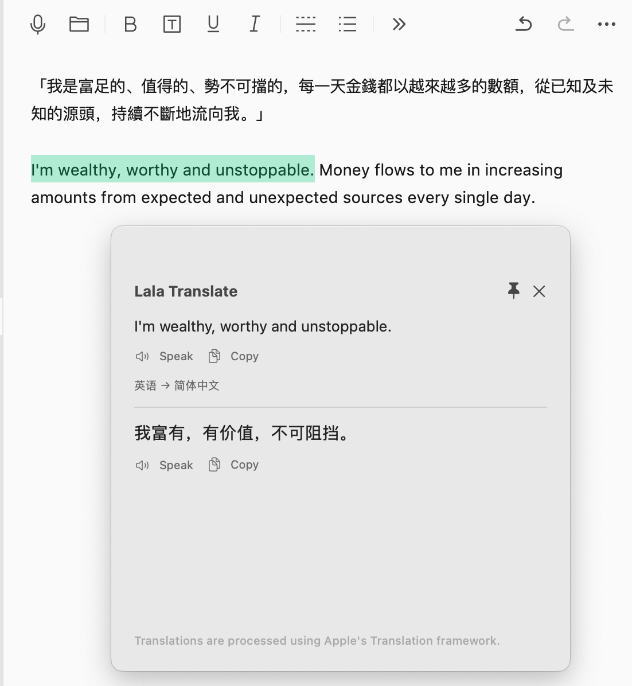

# Lala Translate

[English](README.md) | **简体中文**

一款轻量、原生的 macOS 翻译工具，基于 Apple Translation framework。

**选中文字 → Option + T → 翻译。**

无需账号。无需 API Key。不使用第三方翻译服务。

**[下载 v0.1.0 Beta](https://github.com/annamade-design/lala-translate/releases/tag/v0.1.0-beta)**

macOS 15+ · Apple Silicon · Beta

> **Beta：**当前预编译版本使用 ad-hoc 签名，尚未经过 Apple notarization。首次启动时，macOS 可能需要你在「系统设置 → 隐私与安全性」中手动允许打开。



## 快速开始

1. 下载最新的 Beta 版本。
2. 解压 `LalaTranslate-v0.1.0-beta-macOS-arm64.zip`。
3. 将 `Lala Translate.app` 移动到「应用程序」文件夹 `/Applications`。
4. 打开 Lala Translate。
5. 前往「系统设置 → 隐私与安全性 → 辅助功能」，为 Lala Translate 开启辅助功能权限。
6. 在其他 App 中选中文字。
7. 按 **Option + T** 即可翻译。

如果辅助功能无法直接读取当前选中的文字，Lala Translate 会在用户主动触发翻译时使用 Clipboard fallback 获取选区，并尽可能恢复原来的剪贴板内容。

## 首次打开被 macOS 阻止怎么办

当前 Beta 使用 ad-hoc 签名，尚未经过 Apple Developer ID 签名和 notarization，因此 macOS 首次启动时可能阻止打开。

处理方法：

1. 先尝试打开一次 Lala Translate。
2. 打开「系统设置 → 隐私与安全性」。
3. 找到关于 Lala Translate 的安全提示。
4. 点击「仍要打开 / Open Anyway」。

不需要关闭 Gatekeeper，也不需要使用任何绕过安全机制的 Terminal 命令。

## 功能

- **Option + T** 全局快捷键，以及菜单栏中的 **Translate Selected Text**。
- 通过 macOS 辅助功能读取当前选中的文字；无法读取时，在用户主动翻译时使用 Clipboard fallback。
- 不后台监听剪贴板，也不会在普通 Command+C 后自动翻译。
- 中文 → 英文；英文 → 简体中文。v0.1 中 Latin-script text 按英文处理，以提高英文单词和短语的识别稳定性；其他非 Latin 语言在系统支持时可能通过 macOS Natural Language API 识别并翻译为简体中文。
- 原生浮动翻译面板，支持 Speak、Copy 和 Pin。
- 可选 Launch at Login。
- 无账号、无 API Key、不使用第三方翻译 API，也不保存翻译历史。

## 系统要求

- macOS 15 或更高版本。
- 当前 Beta 预编译版本支持 Apple Silicon (`arm64`)。
- 需要开启辅助功能权限。

## 隐私

翻译使用 Apple Translation framework。不使用 Google、DeepL、OpenAI 或其他第三方翻译 API，也不保存翻译历史。

Lala Translate 不会在后台监听剪贴板。Clipboard fallback 只会在用户主动翻译、且辅助功能无法读取选区时使用，并会尽可能恢复原来的剪贴板内容。

## 开发

以下命令供开发者使用：

```sh
./scripts/build.sh
./scripts/check.sh
```

## License

MIT License

Copyright (c) 2026 Anna Cheung
